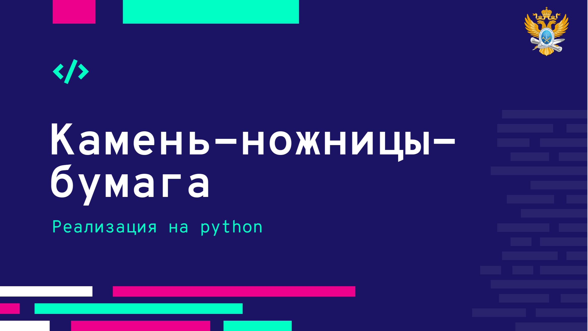

# Кодовая битва: создание своей версии Камень-Ножницы-Бумага

<br>

## Содержание

1. [Теоретическое введение](./readme.md#теоретическое-введение)
2. [Изображения и материалы](./readme.md#изображения-и-материалы)
3. [Готовый код](./readme.md#готовый-код)

-------

<br>


## Теоретическое введение

<br>

## Изображения и материалы

<br>

## Готовый код

```python

# -*- coding: utf-8 -*-
import random

while True:  # обратите внимание на эту строку кода
    user_action = input("Сделайте выбор — камень, ножницы или бумага: ")
    possible_actions = ["🪨 - камень", "📃 - бумага", "✂ - ножницы"]
    computer_action = random.choice(possible_actions)
    if user_action not in ["камень", "бумага", "ножницы"]:
        print('Некорректно введённые данные!\nПопробуйте еще раз.\n')
        continue
    print(f"\nВы выбрали {user_action}, компьютер выбрал {computer_action}.\n")

    if user_action == computer_action[4:]:
        print(f"Оба пользователя выбрали {user_action}. Ничья!!")
    elif user_action == "камень":
        if computer_action[4:] == "ножницы":
            print("Камень бьет ножницы! Вы победили!")
        else:
            print("Бумага оборачивает камень! Вы проиграли.")
    elif user_action == "бумага":
        if computer_action[4:] == "камень":
            print("Бумага оборачивает камень! Вы победили!")
        else:
            print("Ножницы режут бумагу! Вы проиграли.")
    elif user_action == "ножницы":
        if computer_action[4:] == "бумага":
            print("Ножницы режут бумагу! Вы победили!")
        else:
            print("Камень бьет ножницы! Вы проиграли.")
    # а также обратите внимание на код ниже
    play_again = input("Сыграем еще? (д/н): ")
    if play_again.lower() != "д":
        break


```


<br><br>
<br><br>

###### 05.05.2025
