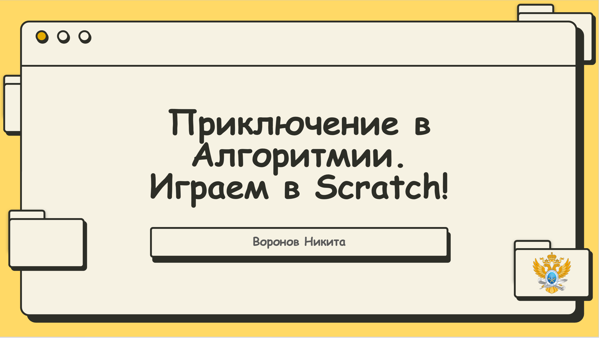
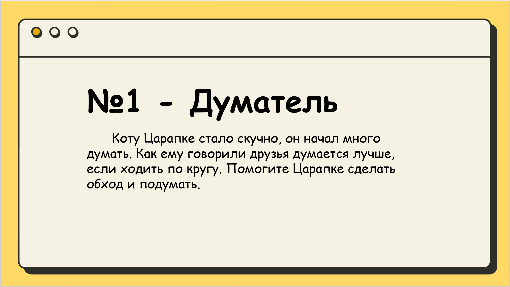
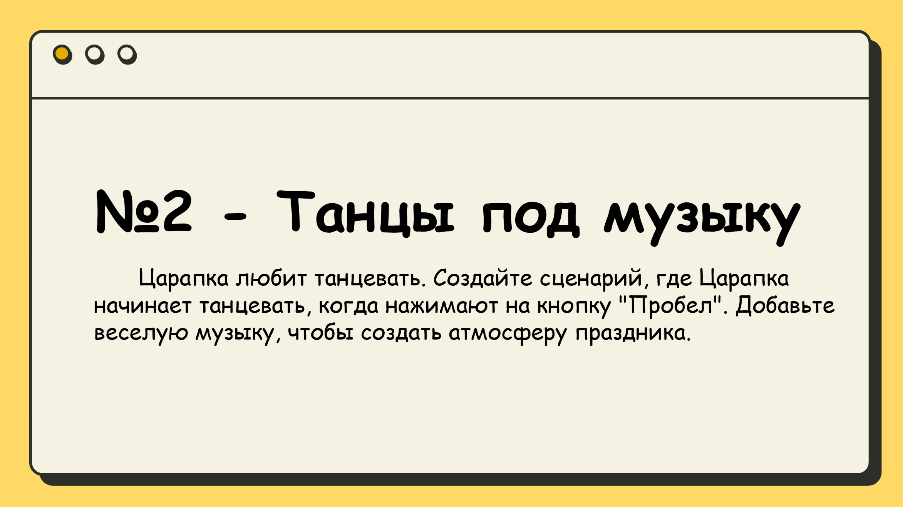
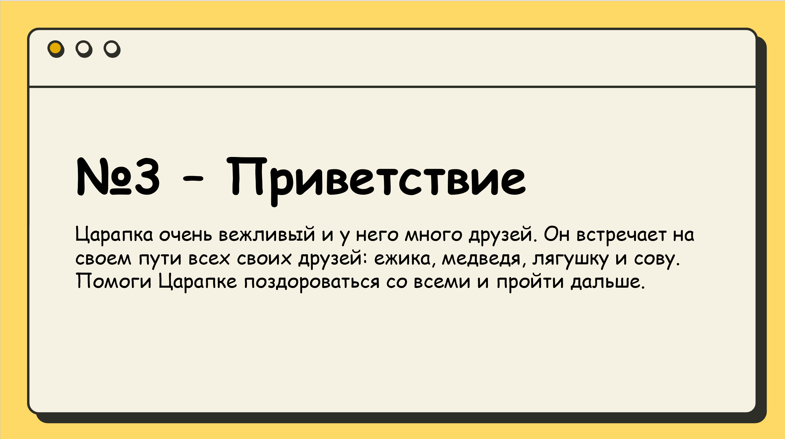

# **Приключение в Алгоритмии. Играем в Scratch!**

 

## Содержание

1. [Теоретическое введение](./readme.md#теоретическое-введение)
2. [Примеры проведения](./readme.md#примеры-проведения)
3. [Материалы и подготовка](./readme.md#материалы-и-подготовка)
4. [Медиа материалы](./readme.md#медиа-материалы)

-----

  

## Теоретическое введение

**Алгоритм** - это последовательность действий, которая приводит к определенным *ожидаемым* результатам.
Каждый день каждый из нас выполняет определенный алгоритм действий, но мы выполняем их не задумываясь. А вот когда приходится сталкиваться с нестандартной задачей, то приходится уже подумать.

**Scratch** — это визуальный язык программирования для детей. Он в игровой форме учит создавать программы в виде наборов цветных блоков, где каждый блок что-то делает. С помощью языка можно создавать анимации и простые игры.

 

## Примеры проведения

Примеры заданий для проведения. Дети должны реализовать **все из них**, чтобы получить баллы/фигурку

 

## Материалы и подготовка

**Текстовой версии МК:** нет

**Презентация (авторства Воронова Никиты):** [pdf](./Приключения%20в%20мир%20Алгоритмии%20-%20Scratch.pdf)

 

## Медиа материалы

❌

  
  

###### 28.04.2025